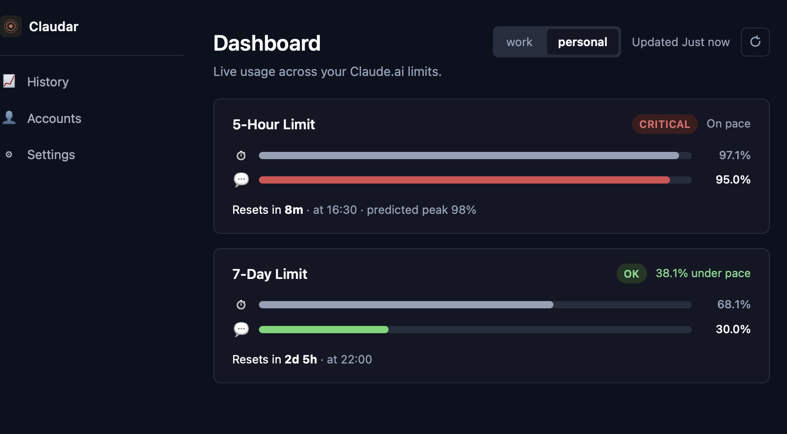
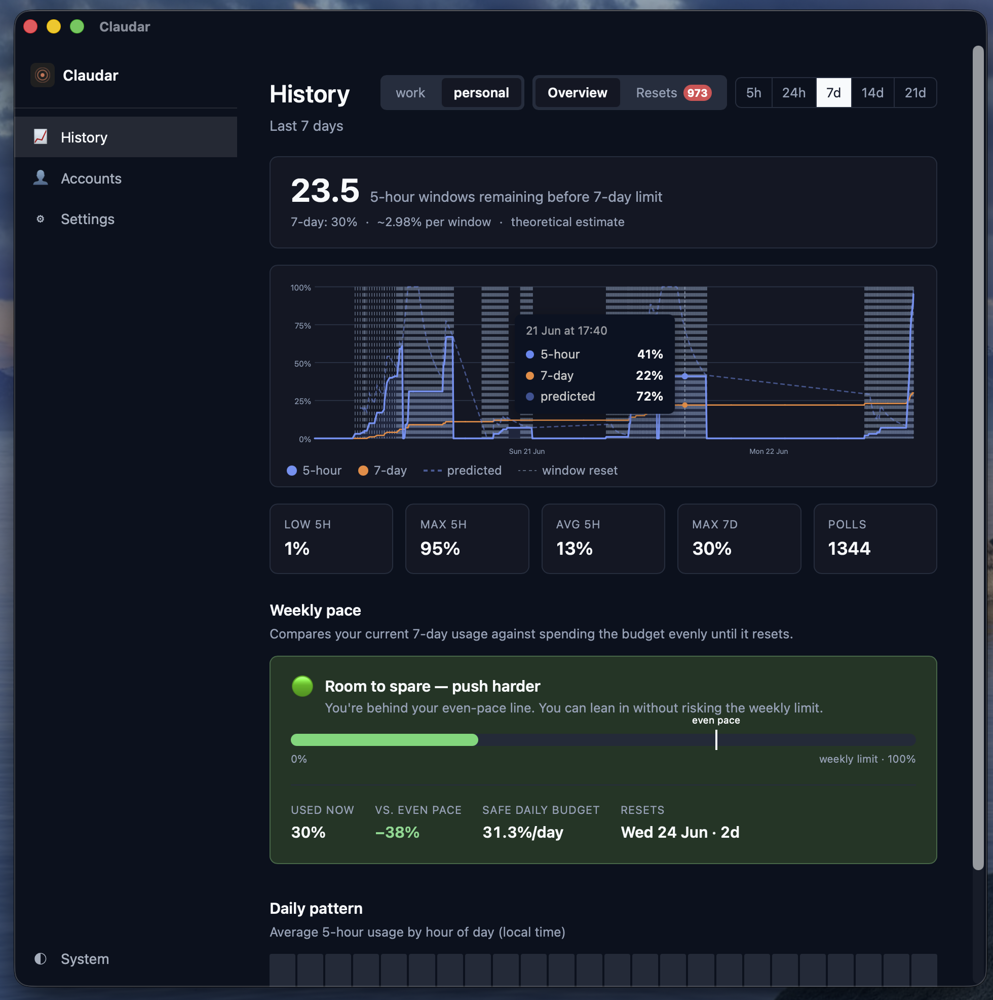

# Claudar

A "lightweight" Rust daemon that monitors your Claude.ai usage limits and sends native desktop notifications when approaching rate limits.

## Why This Tool?

Claude Code's built-in `/usage` command only shows locally tracked usage, which is inaccurate if you use Claude across multiple machines or browser sessions with the same account. Claudar fetches your **actual usage data directly from claude.ai** via authenticated browser requests, giving you an accurate, real-time view of your rate limits regardless of how many devices you use.

## Features

- **Accurate Multi-Device Usage**: Fetches real usage data from claude.ai, not local estimates
- **Native OS Notifications**: Cross-platform notifications (macOS, Linux) when approaching usage thresholds
- **Smart Monitoring**: Threshold crossings, predicted overage warnings, and reset notifications
- **Configurable Thresholds**: Monitor both 5-hour and 7-day usage limits
- **Background Service**: Install as launchd (macOS) or systemd (Linux) service for automatic monitoring
- **Multiple Accounts**: Monitor multiple Claude accounts simultaneously
- **Minimal Footprint**: Low memory and CPU usage

## Screenshots

| Dashboard | History |
| --- | --- |
|  |  |

## Download & Install (Recommended)

1. Go to [Releases](https://github.com/kingsyy/claudar/releases) and download the file for your system:
   - **macOS** — `Claudar_<version>_universal.dmg` (runs on both Intel and Apple Silicon)
   - **Windows** — `Claudar_<version>_x64-setup.exe` (installer) or `..._x64_en-US.msi`
   - **Linux** — `Claudar_<version>_amd64.AppImage` or `..._amd64.deb`
2. Open the installer and drag/install Claudar, then launch it. The app guides you through login on first run.

### macOS: "Claudar can't be opened" / unidentified developer

The macOS builds are **not yet code-signed or notarized** by Apple, so Gatekeeper blocks
the first launch. This is expected — pick one of these to open it:

- **Right-click → Open** on `Claudar.app`, then click **Open** in the dialog. (Only needed once.)
- Or, after the first blocked attempt, go to **System Settings → Privacy & Security**, scroll to
  the *Security* section, and click **Open Anyway** next to the Claudar message.
- Or, from a terminal, clear the quarantine flag:

  ```bash
  xattr -dr com.apple.quarantine /Applications/Claudar.app
  ```

## Build from Source

### Prerequisites

- Rust 1.70+ (install from [rustup.rs](https://rustup.rs))
- Chrome or Chromium browser installed on your system

### Installation

```bash
# Clone the repository
git clone https://github.com/kingsyy/claudar.git
cd claudar

# Build the project
cargo build --release

# Install to your PATH (optional)
cargo install --path .

# Free up build artifacts (~20GB) — safe to run after installing
cargo clean
```

### Quick Start

```bash
# 1. Run the setup wizard
claudar setup

# 2. Check your current usage
claudar usage

# 3. Install as background service (optional)
claudar setup-service
claudar start
```

## Setup

Run the interactive setup wizard:

```bash
claudar setup
```

The setup wizard will:

1. **Open Chrome** with remote debugging for authentication
2. **Let you log in** to your Claude.ai account manually in the browser
3. **Extract session cookies** and organization ID automatically
4. **Test the API connection** to verify everything works
5. **Save configuration** for future use

## Usage

### Check Current Usage

```bash
# View current Claude API usage with progress bars
claudar usage

# View with verbose debug output
claudar usage --verbose
```

### Check Service Status

```bash
# View service status, configuration, and session info
claudar status
```

### Monitor in Foreground

```bash
# Run monitor in foreground (shows logs, press Ctrl+C to stop)
claudar run

# Run with verbose output
claudar run --verbose
```

### Install as Background Service

```bash
# Install as system service (launchd on macOS, systemd on Linux)
claudar setup-service

# Start the background service
claudar start

# Stop the background service
claudar stop

# Uninstall the service
claudar uninstall-service
```

**Note**: After installing as a service, it will automatically start monitoring in the background. On macOS, logs are written to `/tmp/claudar.log` and `/tmp/claudar.error.log`.

### Manage Configuration

```bash
# List all configuration values
claudar config list

# Get a specific configuration value
claudar config get general.poll_interval_seconds

# Set a configuration value
claudar config set general.poll_interval_seconds 600      # Poll every 10 minutes
claudar config set thresholds.five_hour 50,75,90,95       # Custom thresholds
claudar config set notifications.sound false              # Disable sounds
```

**Available configuration keys:**
- `general.poll_interval_seconds` - How often to check usage (minimum: 60 seconds)
- `general.timezone` - Timezone for displayed times (`local`, `UTC`, or IANA name)
- `thresholds.five_hour` - Percentage thresholds for 5-hour limit (comma-separated, 0-100)
- `thresholds.seven_day` - Percentage thresholds for 7-day limit (comma-separated, 0-100)
- `notifications.sound` - Enable/disable notification sounds (true/false)
- `notifications.persistent` - Keep notifications on screen (true/false)
- `notifications.notify_threshold_crossings` - Alert when crossing thresholds (true/false)
- `notifications.notify_predicted_overage` - Warn if predicted to exceed limit (true/false)
- `notifications.notify_resets` - Notify when usage limits reset (true/false)
- `notifications.minutes_before_five_hour_reset` - Alert X minutes before 5-hour reset (number or `disabled`)
- `notifications.minutes_before_seven_day_reset` - Alert X minutes before 7-day reset (number or `disabled`)

**Note**: After changing configuration, restart the service if running in the background:
```bash
claudar stop
claudar start
```

### Multiple Accounts

Monitor multiple Claude accounts simultaneously (e.g., work and personal). Each instance has its own session credentials and notification state, stored separately under `~/.config/claudar/sessions/` and `~/.config/claudar/state/`.

```bash
# Add instances
claudar instances add work
claudar instances add personal

# List configured instances
claudar instances list

# Set up each instance (opens Chrome for login)
claudar setup --instance work
claudar setup --instance personal

# View usage for all instances at once
claudar usage

# View usage for a specific instance
claudar usage --instance work

# Remove an instance (deletes its session and state files)
claudar instances remove work
```

When running as a background service or in foreground mode (`claudar run`), all configured instances are monitored in each polling cycle. Notifications include the instance name as a prefix so you can tell which account they refer to.

If no instances are configured, a single "default" instance is used automatically — no changes needed for single-account setups.

## Configuration

Configuration is stored at: `~/.config/claudar/config.toml`

Default settings:
```toml
[general]
poll_interval_seconds = 900  # 15 minutes
timezone = "local"

[thresholds]
five_hour = [50, 70, 90]
seven_day = [50, 70, 90]

[notifications]
sound = true
persistent = false
notify_threshold_crossings = true
notify_predicted_overage = true
notify_resets = true
```

Session data is stored at: `~/.config/claudar/sessions/`
Monitor state is stored at: `~/.config/claudar/state/`

## How It Works

1. **Browser Authentication**: Connects to Chrome with remote debugging to log in to claude.ai, bypassing Cloudflare bot detection
2. **Cookie Extraction**: Extracts session cookies (`sessionKey`, `cf_clearance`, etc.)
3. **API Polling**: Uses a headless browser to make authenticated requests to the claude.ai usage API
4. **Smart Notifications**: Calculates usage rate and sends timely native desktop notifications

### Notification Types

1. **Threshold Crossings** (50%, 70%, 90%)
   - Notified once per threshold per reset period
   - Example: "You've used 70% of your 5-hour limit. Resets in 2h 15m"

2. **Predicted Overage** (5-hour limit only)
   - Warns if current usage rate suggests exceeding 100% before reset
   - Example: "At current pace, you'll use 115% of your 5-hour limit before reset"

3. **Reset Notifications**
   - Sent when usage limits reset
   - Example: "Your 5-hour usage limit has been reset"

4. **Upcoming Reset Notifications** (optional)
   - Alert before limits reset so you can use remaining capacity

5. **Unused Capacity Warnings** (optional)
   - Alert when significant unused capacity is about to expire

The monitor maintains state to avoid duplicate notifications and automatically clears notification state when limits reset.

## Security

**Session encryption.** Your Claude.ai session cookies are authentication tokens that grant
access to your account, so Claudar encrypts them at rest with **AES-256-GCM**. The encryption
key is stored in your OS keychain (macOS Keychain, Linux Secret Service, Windows Credential
Manager); if no keychain backend is available it falls back to a key file with `0600`
permissions alongside the data. Keychain access is scoped to a **single** named item
(service `claudar`, account `session-encryption-key`) — Claudar never enumerates or reads any
other keychain entry. On first access the OS may prompt for permission, and the prompt names
this item so you can see exactly what's being requested.

**Data location.** Sessions, state, and history live under the platform config directory —
`~/Library/Application Support/claudar/` on macOS, `~/.config/claudar/` (or
`$XDG_CONFIG_HOME`) on Linux, and `%APPDATA%\claudar\` on Windows.

**Unsigned binaries.** Release builds are **not yet code-signed or notarized**, so macOS
Gatekeeper and Windows SmartScreen will warn on first launch — see the install instructions
above for how to proceed. Verify you're downloading from the official
[Releases](https://github.com/kingsyy/claudar/releases) page.

## Troubleshooting

### "Failed to launch browser"
- Make sure Chrome or Chromium is installed
- Check that Chrome is in your PATH

### "API test failed"
- Ensure you completed the login process in the browser
- Ensure you have an active Claude.ai account

### Cookies expire
- Re-run `claudar setup` to refresh your session

## Development

```bash
# Run with debug logging
RUST_LOG=debug cargo run -- setup

# Run tests
cargo test

# Build optimized release
cargo build --release
```

## License

This project is licensed under the [MIT License](LICENSE).

## Contributing

Contributions welcome! Please open an issue or submit a pull request.
This whole project was vibe coded. Any comments or suggestions are welcome!
